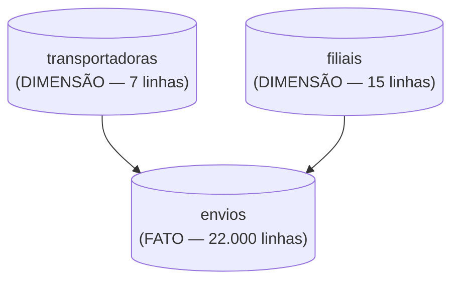

🏷️ Requisitos & Arquitetura

# Análise de Dados na Prática: Performance de Entregas de uma Transportadora Nacional

Projeto de portfólio de Vitor Franca, engenheiro civil migrando para análise de dados. Este documento segue o modelo de documentação padrão do portfólio (`MODELO_DOCUMENTACAO_ANALISE_DADOS.md`) — mesma estrutura usada no `projeto-banco-digital`, só trocando o domínio e os dados.

Repositório: `projeto-logistica-entregas` (GitHub) · Dashboard: Power BI

---

## Requisitos e Configurações do Projeto

### 1. Pré-requisitos de Software (Ambiente Local)

* PostgreSQL 14+ (instalação local, com `psql` e pgAdmin 4)
* Power BI Desktop
* Python 3.x, para gerar a base sintética
* Conta no GitHub
* Dataset: CSVs sintéticos gerados em Python (`transportadoras.csv`, `filiais.csv`, `envios.csv`)

### 2. Fundamentos das Tecnologias

PostgreSQL – Conceitos Fundamentais (schema, DDL, constraints, window functions, CTE)
Power BI – Conceitos Fundamentais (modelo semântico, medidas DAX, colunas calculadas, mês anterior sem tabela calendário)
GitHub – Conceitos Fundamentais (repositório, README, commits)
Modelagem Relacional – Fundamentos (tabela dimensão x tabela fato)

### Dataset - Informações

Base sintética gerada em Python, calibrada com KPIs setoriais públicos (ANTT, ILOS, CNT) para ficar fiel ao padrão real de operação de transportadora — SLA geral próximo de 85%, Norte com atraso maior que Sudeste, pico de volume em novembro/dezembro.

---

### 3. Principais Conceitos de Dados Utilizados

**Schema**
Namespace dentro do banco de dados que agrupa as tabelas do projeto (`logistica`), separado do schema `public` padrão.
________________

**SLA (Service Level Agreement)**
Percentual de envios entregues dentro do prazo prometido, sobre o total de envios entregues. É o KPI central do projeto.
________________

**Coluna calculada `no_prazo`**
Coluna binária (1/0) que marca se a entrega aconteceu no prazo: `status = 'Entregue'` e `data_entrega <= data_prometida`, comparando só a parte de data (sem a hora) das duas colunas.
________________

**Window function `LAG`**
Função que traz o valor de uma linha anterior dentro de uma janela ordenada — usada para comparar o SLA e o volume de um mês contra o mês anterior sem precisar de tabela calendário.
________________

**CTE (Common Table Expression)**
Tabela temporária criada dentro de uma query usando `WITH`, usada para organizar os 10 blocos de KPI em passos legíveis.
________________

**Custo por Km**
Valor do frete dividido pela distância percorrida — indicador de eficiência de custo por modal (rodoviário, aéreo, rodoaéreo).
________________

**Modal**
Meio de transporte do envio: rodoviário (~90% do volume), aéreo (~8%, mais caro) ou rodoaéreo (~2%).
________________

**Medida DAX**
No Power BI, cálculo definido em DAX que agrega dados sob demanda, como `SLA % = DIVIDE([No Prazo (qtd)], [Entregues])`.
________________

**Modelo semântico**
Camada do Power BI onde ficam as tabelas, relacionamentos e medidas — a base sobre a qual os gráficos do dashboard são construídos.

---

## ◾ Fluxo das Ferramentas (Arquitetura do Projeto)


Mesmo diagrama gerado no Claude Design usado no `projeto-banco-digital` (prompt salvo em `PROMPTS_CLAUDE_DESIGN.md`) — o pipeline de ferramentas é idêntico entre os dois projetos, só muda o domínio dos dados. Não precisa gerar um novo diagrama pra isso.

Papel de cada etapa no pipeline: Python entrega os dados brutos em CSV; PostgreSQL é onde o dado é modelado, limpo e analisado (é daqui que saem os números oficiais do projeto); Power BI transforma o resultado das análises num dashboard visual; GitHub documenta e publica o código e os resultados; LinkedIn divulga o projeto pronto.

---

## ◾ PostgreSQL - Conceitos

O PostgreSQL é o banco de dados relacional usado para modelar, limpar e analisar os dados do projeto.

Papel no pipeline: camada de modelagem e análise — é onde os CSVs viram tabelas estruturadas e onde saem todos os números usados no README e no dashboard.

Estrutura básica



Como foi usado no projeto: schema próprio (`logistica`, não `public`), com chaves primárias, foreign keys e constraints garantindo a integridade. Depois da carga, roda-se limpeza (nulos, colunas derivadas como `no_prazo`, `dias_atraso`, `frete_por_kg`, `ano_mes`, `custo_km`) e os blocos de análise com CTE, `RANK`, `LAG` e `PERCENTILE_CONT`.

Comandos principais

| Comando | O que faz |
|---|---|
| `psql -f 02_sql/01_criar_tabelas.sql` | Cria o schema, as tabelas, constraints e índices |
| `\copy tabela FROM 'arquivo.csv' WITH (FORMAT csv, HEADER true, DELIMITER ';')` | Carrega os dados do CSV na tabela |
| `SET search_path TO logistica, public;` | Aponta a sessão pro schema do projeto |
| `psql -f 02_sql/04_analises.sql` | Roda os blocos de KPI (SLA, ranking de transportadoras, evolução mensal) |

---

## ◾ Python - Conceitos

Usado só na etapa de geração da base sintética: cria os três CSVs (`transportadoras`, `filiais`, `envios`) calibrados com KPIs setoriais públicos (ANTT, ILOS, CNT), simulando uma operação nacional de transportadora sem usar dado real de nenhuma empresa.

---

## ◾ Power BI - Conceitos

O Power BI é a ferramenta de BI usada para montar o dashboard final do projeto.

Papel no pipeline: recebe o modelo direto das tabelas exportadas em Excel (`base_dados_logistica.xlsx`) e transforma os resultados das análises em visuais interativos.

Como foi usado no projeto: modelo semântico com relacionamentos `transportadoras → envios` e `filiais → envios` (1 para muitos), colunas calculadas espelhando a limpeza feita em SQL, e 16 medidas DAX — `Envios Totais`, `Entregues`, `No Prazo (qtd)`, `SLA %`, `Receita Frete`, `Ticket Medio`, `Dias Medio Entrega`, `Custo por Km Medio`, `Envios Mes Anterior`, `Crescimento MoM %`, `SLA Mes Anterior`, `Delta SLA (p.p.)` entre outras.

Visuais usados, pelo nome exato no painel Visualizações do Power BI Desktop: **Cartão** (KPIs de topo), **Mapa** (SLA por região — o mapa de bolhas por UF individual não geocodifica direito nomes de estado brasileiro contra o Bing Maps, então o painel usa uma imagem estática por região gerada no Claude Design), **Gráfico de Barras Agrupadas** (ranking de transportadoras), **Gráfico de Linhas** (evolução mensal de SLA) e **Gráfico de Colunas Clusterizadas e Linhas** (Ticket Médio x SLA % por modal, eixo duplo).

---

## ◾ GitHub - Conceitos

Repositório público usado para publicar o código, os dados e a documentação do projeto.

Estrutura padrão de pastas

```
02_sql/
  01_criar_tabelas.sql    — DDL: schema, PKs, FKs, constraints, índices
  02_carregar_dados.sql   — \COPY dos CSV
  03_limpeza.sql          — nulos, colunas derivadas
  04_analises.sql         — 10 blocos de KPI

03_dados/
  transportadoras.csv, filiais.csv, envios.csv

06_prints/
  fluxograma_ferramentas.png, prints reais da execução no PostgreSQL, print do dashboard final

README.md
GUIA_POWER_BI.md
05_post_linkedin.md
```

Regra de conteúdo do README: título, pergunta de negócio, stack, estrutura do repositório, principais achados (números reais), sobre os dados, autor.

---

## 🎲 Dataset - Informações

### TABELA: transportadoras (dimensão)

Descrição: cadastro das transportadoras parceiras.

Colunas
* `transportadora_id` — identificador único
* `nome` — nome fictício da transportadora
* `tipo` — rodoviário ou aéreo
* `sede_uf` — UF sede
* `ano_fundacao` — ano de fundação
* `frota_veiculos` — tamanho da frota

### TABELA: filiais (dimensão)

Descrição: centros de distribuição de origem dos envios.

Colunas
* `filial_id` — identificador único
* `cidade` — cidade da filial
* `uf` — UF da filial
* `regiao` — região do Brasil
* `tipo` — porte do centro de distribuição

### TABELA: envios (fato)

Descrição: cada linha é um envio realizado em 2024.

Colunas
* `envio_id` — identificador único do envio
* `transportadora_id`, `filial_origem_id` — referências às dimensões
* `uf_destino`, `regiao_destino` — destino do envio
* `modal` — rodoviário, aéreo ou rodoaéreo
* `categoria_produto` — categoria do item transportado
* `distancia_km`, `peso_kg`, `valor_frete` — características do envio
* `data_coleta`, `data_prometida`, `data_entrega` — timestamps do ciclo de entrega
* `status` — Entregue, Devolvido ou Extraviado
* `motivo` — motivo do atraso, quando houver

### Relação entre as tabelas

`transportadora_id` conecta `transportadoras` a `envios`. `filial_origem_id` conecta `filiais` a `envios`. `envios` é a tabela fato usada para medir SLA, receita de frete, ticket médio e evolução mensal.

### Números reais confirmados (base de verdade — não inventar)

* 22.000 envios · 21.729 entregues · 18.477 no prazo · 128 devolvidos · 143 extraviados
* SLA geral: 85,03%
* Receita de frete: R$ 1.037.081,11 · Ticket médio: R$ 47,14 · Tempo médio de entrega: 4,39 dias · Custo por km médio: R$ 0,06
* SLA por região, do melhor pro pior: Sudeste 88,04% · Sul 87,21% · Centro-Oeste 86,03% · Nordeste 82,71% · Norte 76,57%
* Ranking de SLA por transportadora: AeroExpress 87,56% (1º) · SwiftLog Brasil 87,47% · Bandeirantes Log 86,16% · Costa Sul Transporte 85,90% · AtlanticoCargo 83,24% · Fenix Delivery 82,04% · TransNorte Cargo 77,82% (último)

Esses números vieram de execução real de SQL contra a base — qualquer texto novo (README, post do LinkedIn, este documento) tem que bater com eles.

---

## 📋 Checklist de Execução (substitui os capítulos de vídeo — este projeto não tem vídeo)

1. Definir o domínio do projeto (logística) e o escopo de dados
2. Gerar a base sintética em Python, calibrada com KPIs setoriais reais
3. Escrever o DDL com schema próprio + constraints
4. Carregar e validar os dados (contagens batendo com o esperado)
5. Rodar limpeza e as análises reais em SQL — anotar os números exatos
6. Montar o dashboard em Power BI (extração via Excel, modelo, medidas, gráficos)
7. Criar o repositório no GitHub seguindo a estrutura de pastas padrão
8. Escrever o README seguindo o padrão de seções
9. Tirar os prints reais da execução (nunca fabricar print ou número)
10. Escrever o post do LinkedIn com os mesmos números do README
11. Revisar tudo contra a base real antes de publicar

---

## Armadilhas já mapeadas (para não repetir em projetos futuros)

* CSVs usam `;` como delimitador — sempre `DELIMITER ';'` no `\copy`.
* Tabelas ficam no schema `logistica`, não em `public` — sempre `SET search_path` antes de qualquer query.
* Coluna calculada de "no prazo" comparando `data_entrega <= data_prometida` direto quebra quando as colunas são datetime com hora — usar `TRUNC()` (ou equivalente) pra comparar só a data.
* Medida nova criada com o mesmo nome de uma coluna existente trava com erro de nome duplicado — sempre criar como **Nova coluna** (não **Nova medida**) quando for uma coluna calculada, e vice-versa.
* Combinar duas medidas em escalas muito diferentes (ex: Ticket Médio em reais e SLA % em percentual) no mesmo eixo de um gráfico de colunas agrupadas achata a menor — usar **Gráfico de Colunas Clusterizadas e Linhas** com a segunda medida na "Linha" (eixo secundário).
* O visual de **Mapa** do Power BI geocodifica sigla de UF brasileira contra a base do Bing Maps, que pode confundir com sigla de estado americano — nesse caso, a alternativa é gerar uma imagem estática do mapa por região no Claude Design em vez de depender do visual nativo.
* Visuais de Mapa e Mapa Preenchido vêm desabilitados por padrão no Power BI Desktop (Arquivo → Opções e configurações → Opções → Global → Segurança → "Mapa e visuais de Mapa Preenchido").
* Prints gerados por IA têm limite de geração por sessão e podem inventar números — preferir sempre print real, tirado pelo próprio autor.
* Conferir sempre se os números do texto batem com os números reais da execução antes de publicar.
